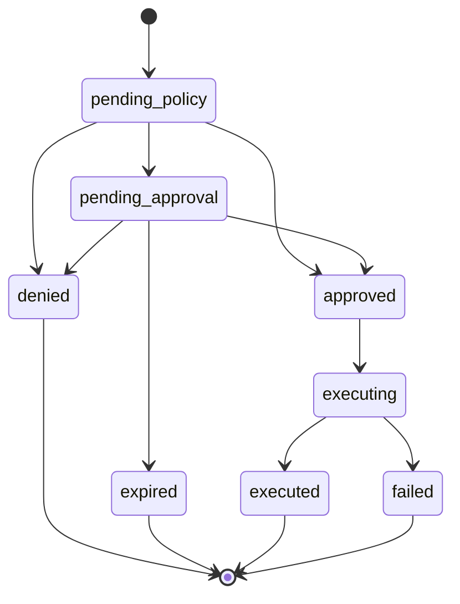

# Action status machine

**shipped** as data — the transition table and its predicate live in
[`src/shared/src/actions.ts`](../src/shared/src/actions.ts) and are covered by
tests. Enforcement at write time lands with the action service in Phase 3.



## The states

| Status | Meaning | Terminal |
|---|---|---|
| `pending_policy` | Recorded, not yet evaluated. Every action starts here | |
| `pending_approval` | Over the fence — waiting on a human | |
| `approved` | Cleared to run, either by policy or by a person | |
| `executing` | Handed to the adapter | |
| `executed` | The adapter succeeded | ✓ |
| `failed` | The adapter threw. A recorded outcome, not a server error | ✓ |
| `denied` | Refused by policy, or refused by a human | ✓ |
| `expired` | The approval token ran out before anyone decided | ✓ |

## The transitions

| From | Legal next |
|---|---|
| `pending_policy` | `denied` · `approved` · `pending_approval` |
| `pending_approval` | `approved` · `denied` · `expired` |
| `approved` | `executing` |
| `executing` | `executed` · `failed` |
| terminal | *nothing* |

Anything not in that table is unreachable by construction.

## Why the shape matters

**Only `approved → executing` reaches an adapter.** There is no edge from
`pending_approval` to `executing`. That single missing edge is the entire
product claim: an action awaiting a human cannot touch Stripe, and the tests
that assert "adapter called zero times" are the ones that prove it.

**`approved` is a distinct state, not a flag.** The action service refuses to
execute anything whose status is not exactly `approved`, which is what makes a
double-clicked approve button safe — the second click finds the action already
`executing` or `executed` and stops.

**`expired` exists so nothing dangles.** When an approval token runs out the
action moves to `expired` rather than sitting in `pending_approval` forever. The
SDK's `waitForAction` polls for a terminal status; without this edge it would
hang until its own timeout on every ignored approval email.

**`failed` is terminal and ordinary.** A declined card ends the action with an
error code recorded. It is not retried automatically and it is not a `500`.

## Terminal statuses

```ts
TERMINAL_STATUSES = ["executed", "failed", "denied", "expired"]
```

`waitForAction` polls until the action reaches one of these. Everything else is
in flight.

## Audit coupling

**Every state transition writes an `audit_events` row.** A status change with no
corresponding event is a bug, not a cosmetic gap — Phase 6 adds a test that
walks every action and cross-checks its terminal status against a terminal
event, so a transition added without an audit write fails the suite.

The event sequence for each path is in [audit-events.md](audit-events.md).
